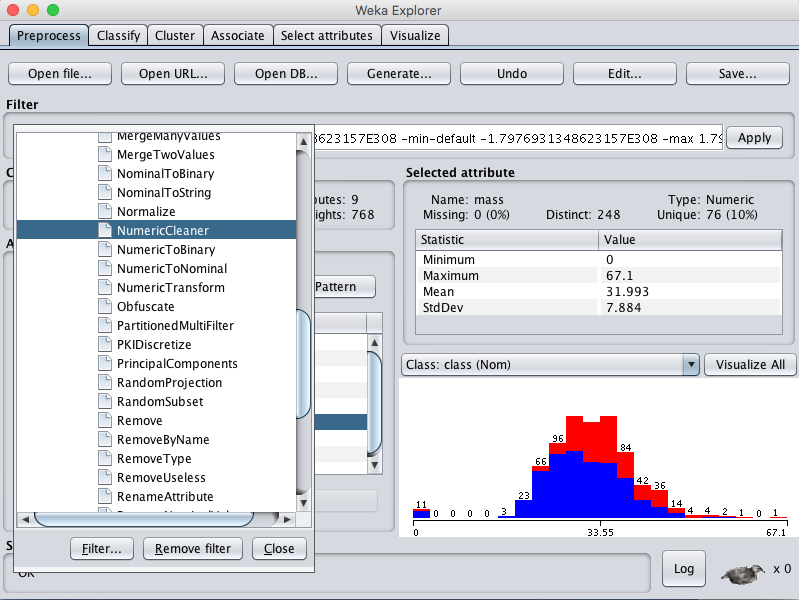

一般情况下，我们很难直接得到特别干净的数据，很多数据中都具有缺失值或者被污染的值。  
因此，在开发机器学习模型时，为了得到最好的性能，如何去**辨认**，**标记**并且**处理**缺失值就显得特别重要。  
在本文中你将会学会如何在你的机器学习数据上利用Weka去处理缺失值  
- 在阅读完本文你将会知道：  
    - 在数据集上如何去标记缺失值  
    - 如何从数据集中移除缺失值  
    - 如何计算缺失值  
# 预测糖尿病的发病  
本例中使用的问题是皮马印第安人糖尿病发病数据集。  
这是一个分类问题，每一行代表一个实例，一个实例就是一个病人的医疗细节。  
任务是去预测是否病人会在接下来的五年之内发病。  
本文来自于[如何用Weka处理缺失值](https://machinelearningmastery.com/how-to-handle-missing-values-in-machine-learning-data-with-weka/)  
- 你可以在下面的链接中了解到更多的关于此数据集的信息：  
    - [数据集文件](https://raw.githubusercontent.com/jbrownlee/Datasets/master/pima-indians-diabetes.csv)
    - [数据集详情](https://raw.githubusercontent.com/jbrownlee/Datasets/master/pima-indians-diabetes.names)
你也可以在Weka的安装包中找到，路径在Weka安装路径的*data/*文件夹下，文件名为*diabetes.arff*  
# 标记缺失值
对于探索缺失值来说，皮马印第安人数据集是一个好的基础。  
一些属性例如血压(pres)，BMI(mass)有0值，这实际上是不可能的。这些都是必须手动标记的有损坏值和缺失值的例子。  
你可以在Weka中使用NumericalCleaner filter(过滤器)，下面的方法向你展示了如何使用这个filter在BMI(mass)属性上标记出11个缺失值。  
1. 打开Weka Explorer
2. 加载皮马印第安人糖尿病发病数据集
3. 点击“Choose”按钮并从Filter中选择NumericalCleaner，它在unsupervized.attribute.NumericalCleaner

